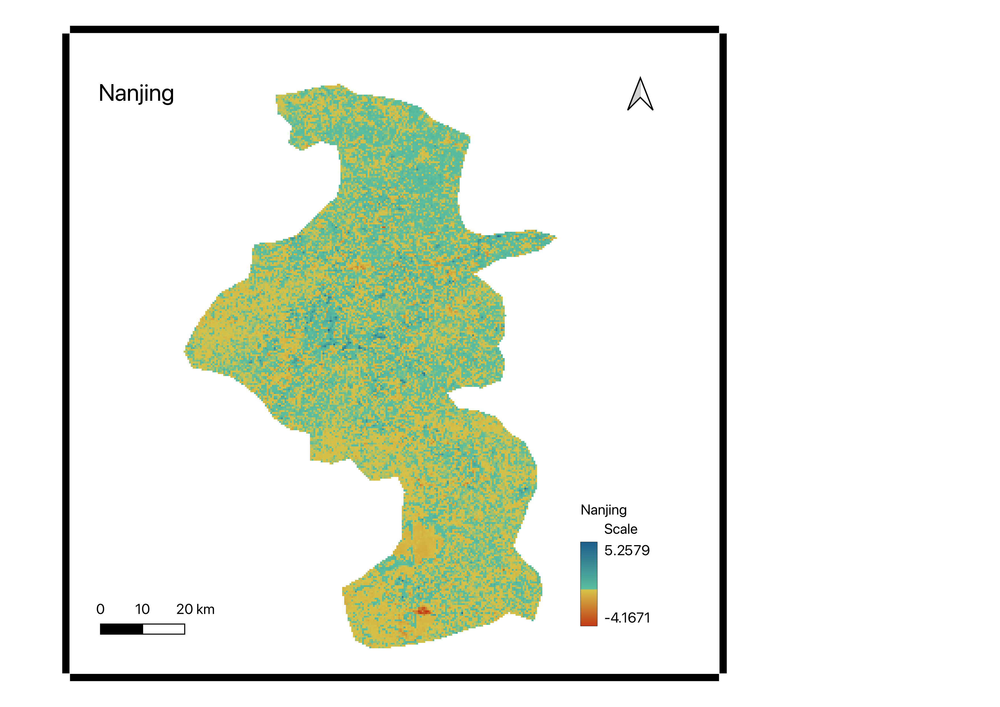
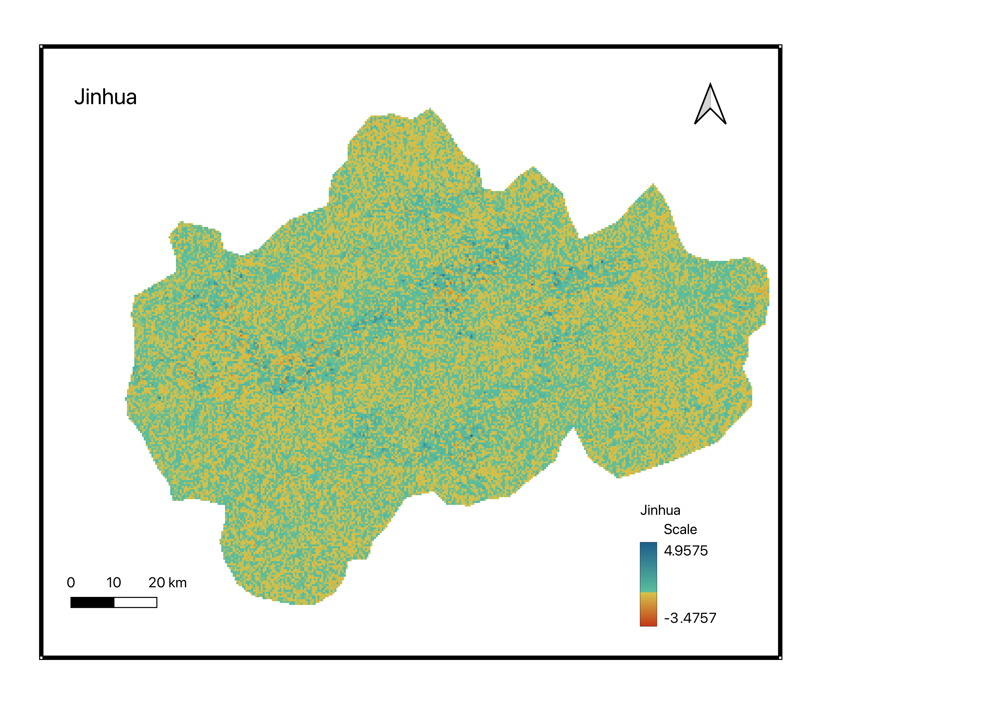
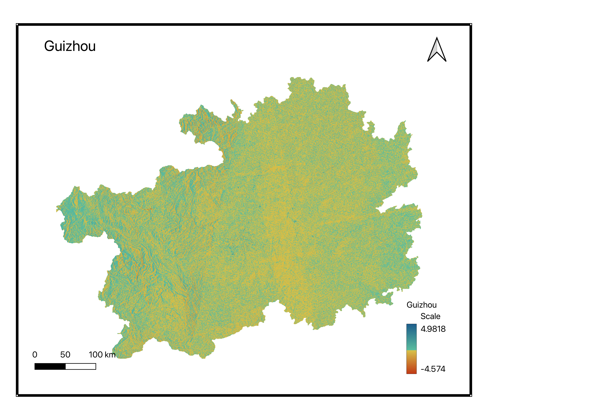
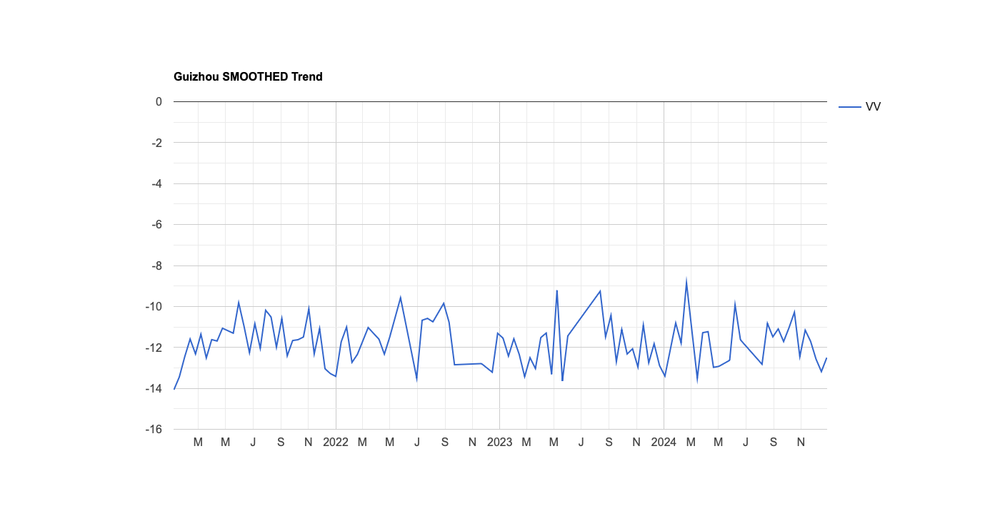
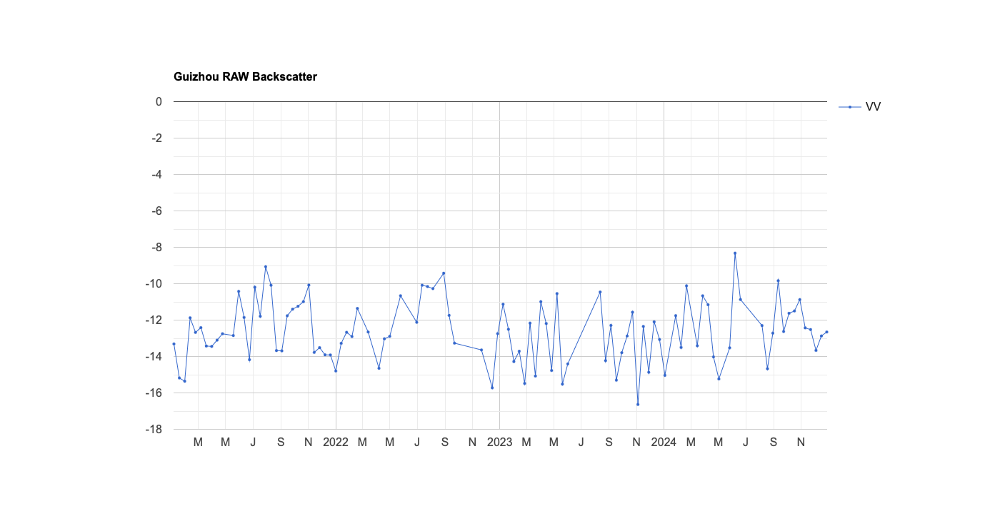
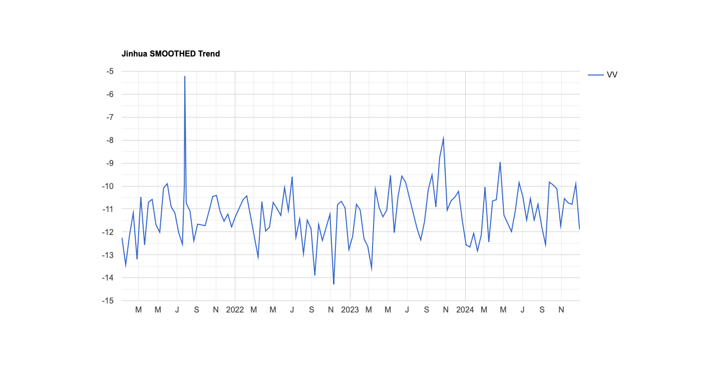
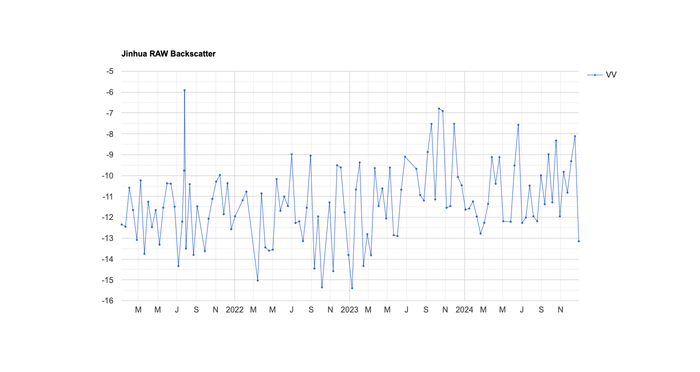
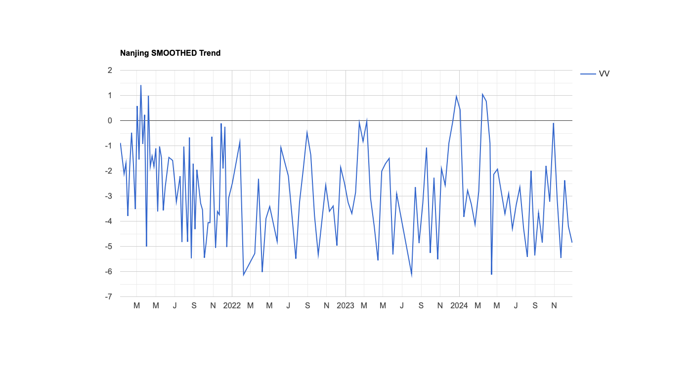
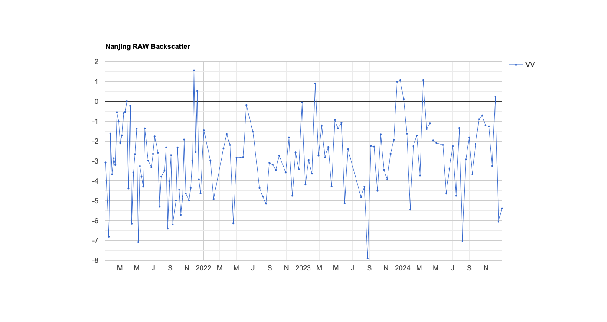

# China Land Subsidence & Uplift Analysis (SAR Backscatter Trend, 2021–2024)

A Google Earth Engine (GEE) workflow that uses Sentinel-1 SAR backscatter trends as a proxy for vertical land motion (subsidence and uplift) across three Chinese administrative areas: **Nanjing**, **Jinhua**, and **Guizhou**.

Rather than full InSAR phase processing, this script fits a linear trend to SAR backscatter intensity over time per pixel, converts the slope into an annualized velocity proxy (mm/year), and compares raw vs. spatially-smoothed results.

## Method

| Category | Component | Description |
|---|---|---|
| Data Sourcing | Sentinel-1 GRD | C-band SAR imagery, 2021–2024, VV polarization, IW mode |
| Data Sourcing | FAO GAUL | Global Administrative Unit Layers used to define the boundaries of Nanjing, Jinhua, and Guizhou |
| Analysis | Linear Regression | Calculates the slope of backscatter intensity over time for every pixel |
| Analysis | Spatial Filtering | Applies focal-mean smoothing to reduce radar speckle noise for a cleaner visual trend |
| Analysis | Unit Conversion | Multiplies the regression slope to convert raw values into annual velocity proxies (mm/year) |
| Analysis | Dynamic Legend | Color-coded legend: Red (Subsidence) → Yellow → Green → Blue (Uplift) |
| Analysis | Time-Series Charts | Interactive charts showing how radar returns changed at representative hotspots over the 4-year period |
| Output | TIFF Exports | 6 raster maps (raw and smoothed velocity) exported to Drive per city |
| Output | CSV Summary | Statistical table of mean/min/max velocity per city for spreadsheet analysis |

## Results

### Velocity maps
Raw vs. smoothed LOS velocity (mm/year) for each area, red = subsidence, blue = uplift.

| Nanjing | Jinhua | Guizhou |
|---|---|---|
|  |  |  |

### Backscatter time series
Representative raw and smoothed backscatter trends at hotspot points in each city.








### Summary table

| City | Method | Observation | Raw Subsidence | Raw Uplift | Raw Mean Velocity | Smoothed Subsidence | Smoothed Uplift | Smoothed Mean Velocity | Scenes | Time Span |
|---|---|---|---|---|---|---|---|---|---|---|
| Nanjing | SAR Backscatter Trend | Spatially heterogeneous deformation with hotspots | -3.4401 | 3.9454 | -0.0011 | -2.7024 | 1.7064 | -0.0037 | 509 | 2021–2024 |
| Jinhua | SAR Backscatter Trend | Spatially heterogeneous deformation with hotspots | -1.2557 | 3.2104 | -0.0085 | -0.5477 | 1.05866 | -0.0089 | 472 | 2021–2024 |
| Guizhou | SAR Backscatter Trend | Spatially heterogeneous deformation with hotspots | -3.2905 | 4.1898 | -0.0382 | -1.7207 | 2.8109 | -0.0379 | 2508 | 2021–2024 |

(velocities in mm/year; values are the backscatter-trend proxy, not calibrated InSAR displacement)

## Repo contents

```
china_subsidence_uplift.js   # full Earth Engine script (linked panel maps, charts, exports)
media/                       # velocity maps + backscatter time-series charts
README.md
```

## Running it

1. Copy `china_subsidence_uplift.js` into the [GEE Code Editor](https://code.earthengine.google.com/).
2. Run — it builds a 3-panel linked map (Nanjing / Jinhua / Guizhou) with raw and smoothed velocity layers, prints backscatter time-series charts per city, and prints a summary statistics table.
3. Uncomment the `Export.image.toDrive` / `Export.table.toDrive` calls (already included) and run them from the **Tasks** tab to export the 6 raster velocity maps and the CSV summary table to Google Drive.

## Notes 

- This is a backscatter-intensity proxy, not phase-based InSAR displacement — useful for flagging relative hotspots of deformation, not absolute millimeter-accurate motion.
- `Guizhou` is handled at province level (bounding box) since GAUL level-2 boundaries weren't used for it; `Nanjing` and `Jinhua` are city-level (GAUL level-2).
